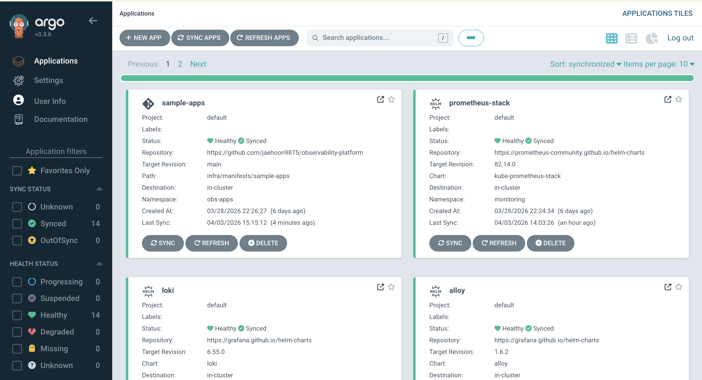
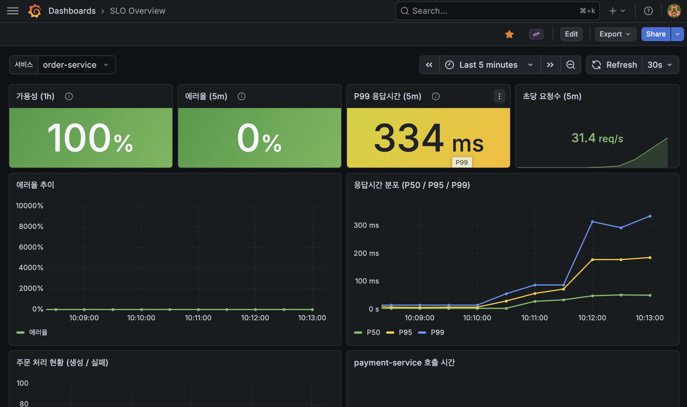
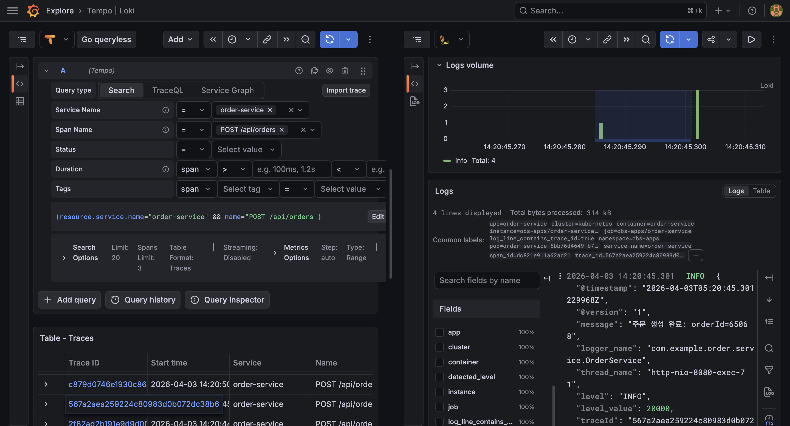

# observability-platform

Kubernetes 기반 MSA 환경에서 Observability 플랫폼을 구축하고, 장애를 시뮬레이션하며, 탐지·대응·분석을 자동화하는 프로젝트입니다.

SRE/Observability 엔지니어링에 관심을 갖고, 실무에서 마주치는 문제(메트릭 수집, 분산 트레이싱, SLO 기반 알림, GitOps 배포)를 직접 구현하며 학습하기 위해 시작했습니다.

> 진행 기간: 2026.03.21 ~ 2026.04.03

## Architecture

```
GitHub Repository
  ├── sample-apps/ (소스 코드 변경)
  │     ↓
  │   GitHub Actions (CI)
  │     ├── 테스트 → 이미지 빌드 → GHCR push
  │     └── infra/ 이미지 태그 업데이트 커밋
  │                          ↓
  └── infra/ (매니페스트/values 변경)
              ↓
            ArgoCD (GitOps)
              └── Git 변경 감지 → 클러스터 자동 sync

┌─────────────────────────────────────────────────────────────────┐
│                      Kubernetes Cluster                         │
│                                                                 │
│  ┌────────────────┐  ┌────────────────┐  ┌──────────────────┐  │
│  │ order-service   │─▶│ payment-service │─▶│ notification-    │  │
│  │ (Java)          │  │ (Java)          │  │ service (Java)   │  │
│  └───────┬────────┘  └───────┬────────┘  └────────┬─────────┘  │
│          │                   │                     │            │
│          ▼                   ▼                     ▼            │
│  ┌──────────────────────────────────────────────────────────┐  │
│  │                  Observability Stack                      │  │
│  │                                                          │  │
│  │  Metrics : Prometheus ──▶ Grafana                        │  │
│  │  Logs    : Alloy ──▶ Loki ──▶ Grafana                    │  │
│  │  Traces  : OpenTelemetry ──▶ Tempo ──▶ Grafana            │  │
│  └──────────────────────────────────────────────────────────┘  │
│                                                                 │
│  ┌───────────────────────┐  ┌──────────────────────────────┐   │
│  │  custom-exporter       │  │  ArgoCD (GitOps)             │   │
│  │  (Kafka Lag 등)        │  │  infra/ 디렉토리 자동 동기화  │   │
│  └───────────────────────┘  └──────────────────────────────┘   │
└─────────────────────────────────────────────────────────────────┘
```

<!-- {ArgoCD UI 스크린샷 - Application 목록 Synced 상태} -->


## 주요 구현 하이라이트

- **GitOps 파이프라인 end-to-end 자동화**: GitHub Actions에서 이미지 빌드/GHCR push → `infra/` 이미지 태그 자동 업데이트 커밋 → ArgoCD 감지 → 클러스터 자동 배포까지 완전 자동화
- **커스텀 Prometheus Exporter 개발**: Prometheus가 기본 수집하지 않는 Kafka Consumer Lag을 Java(Spring Boot + Micrometer)로 직접 개발한 Exporter로 수집 및 Grafana 시각화
- **분산 트레이싱 연동**: OpenTelemetry Java Agent → Tempo → Grafana 로그-트레이스 상관관계(Log-Trace Correlation) 구현
- **SLO 기반 Alert Rule 설계**: 가용성 99.9% / P99 응답시간 500ms 이내 기준으로 Prometheus Alert Rule 작성 및 클러스터 적용 검증
- **Grafana 대시보드 설계**: SLO 현황(가용성·에러 버짓·P99) + JVM 성능 분석(Heap/GC/Thread) 대시보드를 JSON으로 버전 관리, ConfigMap 기반 자동 로드
- **k6 부하 테스트 시나리오**: 정상 트래픽·급증(spike) 시나리오 작성 및 실행으로 Alert Rule 트리거 및 메트릭 변화 검증

<!-- {Grafana SLO 대시보드 스크린샷} -->


<!-- {Grafana 분산 트레이싱 스크린샷 - Tempo 트레이스 + Loki 로그 연동} -->


## 프로젝트 구조

```
observability-platform/
│
├── sample-apps/                  # 테스트 대상 MSA 애플리케이션
│   ├── order-service/            # 주문 API (Spring Boot, Java)
│   ├── payment-service/          # 결제 API (Spring Boot, Java)
│   └── notification-service/     # 알림 API (Spring Boot, Java)
│
├── custom-exporter/              # 직접 개발한 Prometheus Exporter
│   └── kafka-lag-exporter/       # Kafka Consumer Lag 수집기
│
├── infra/                        # IaC + GitOps 매니페스트
│   ├── argocd/                   # ArgoCD Application 정의
│   ├── helm/                     # Helm chart로 관리하는 스택
│   │   ├── kube-prometheus-stack/ #   kube-prometheus-stack (values.yaml + custom-values.yaml)
│   │   ├── loki/                 #   Loki
│   │   ├── tempo/                #   Tempo
│   │   ├── alloy/                #   Grafana Alloy (로그 수집)
│   │   ├── strimzi-operator/     #   Strimzi Kafka Operator
│   │   ├── mysql-operator/       #   MySQL Operator
│   │   ├── kafka-ui/             #   Kafka UI
│   │   └── redis/                #   Redis
│   └── manifests/                # Raw K8s 매니페스트 (kubectl apply / ArgoCD)
│       ├── kafka/                #   Kafka Operator CRD
│       ├── mysql/                #   MySQL Operator InnoDBCluster
│       ├── sample-apps/          #   order / payment / notification service
│       └── k6/                   #   k6 부하 테스트 Job
│
├── dashboards/                   # Grafana 대시보드 JSON
│   ├── slo-overview.json         # SLO 현황 대시보드
│   └── jvm-analysis.json         # JVM 성능 분석 대시보드
│
├── alerts/                       # Prometheus Alert Rule 정의
│   ├── slo-alerts.yaml           # SLO 기반 알림 규칙
│   └── infra-alerts.yaml         # 인프라 상태 알림 규칙
│
├── tests/                        # k6 부하 테스트 시나리오
│   ├── load-test/                # 정상 트래픽 부하 테스트
│   │   └── order-flow.js
│   └── spike-test/               # 트래픽 급증 시뮬레이션
│       └── spike-test.js
│
└── scripts/                      # 운영 자동화 스크립트
    ├── incident-collector.sh     # 장애 시 진단 정보 자동 수집
    └── heap-analyzer.py          # JVM 힙 덤프 분석 도구
```

## 기술 스택

| 영역                   | 기술                                      |
| -------------------- | --------------------------------------- |
| Language & Framework | Java 17, Spring Boot 3.x, JPA/Hibernate |
| Infrastructure       | Kubernetes (kubeadm), ArgoCD            |
| Observability        | Prometheus, Grafana, Loki, Alloy, Tempo |
| Load Testing         | k6                                      |
| Scripting            | Python, Shell Script                    |
| Database             | MySQL, Redis, Kafka                     |
| CI/CD                | GitHub Actions, ArgoCD                  |

## Getting Started

**사전 요구사항**: Kubernetes 클러스터 (kubeadm), kubectl, Helm 3.x, ArgoCD

1. ArgoCD 설치 및 설정 → [docs/argocd-setup.md](docs/argocd-setup.md)
2. `infra/argocd/` 의 Application 매니페스트 등록 → 클러스터 자동 동기화
3. sample-apps DB Secret 수동 생성 → [docs/mysql-setup.md](docs/mysql-setup.md)
4. k6 부하 테스트 실행 → [docs/run-k6-guide.md](docs/run-k6-guide.md)

## 문서

| 문서 | 설명 |
|------|------|
| [docs/argocd-setup.md](docs/argocd-setup.md) | ArgoCD 설치 및 Application 등록 가이드 |
| [docs/kafka-setup.md](docs/kafka-setup.md) | Kafka(Strimzi) 구성 가이드 |
| [docs/mysql-setup.md](docs/mysql-setup.md) | MySQL Operator 구성 및 DB 초기화 |
| [docs/run-k6-guide.md](docs/run-k6-guide.md) | k6 부하 테스트 실행 가이드 |
| [docs/load-testing.md](docs/load-testing.md) | 부하 테스트 시나리오 및 결과 |
| [docs/observability-testing-guide.md](docs/observability-testing-guide.md) | Observability 스택 동작 검증 가이드 |
| [docs/incident-collector-guide.md](docs/incident-collector-guide.md) | 장애 진단 스크립트 사용 가이드 |
| [docs/PLAN.md](docs/PLAN.md) | 단계별 실행 계획 및 진행 상황 |
| [docs/ISSUES.md](docs/ISSUES.md) | 이슈 및 개선 항목 |

## 실행 환경

- 싱글노드 Kubernetes 클러스터 (kubeadm)
- OS: Linux (홈서버)
